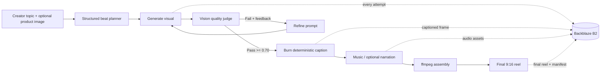
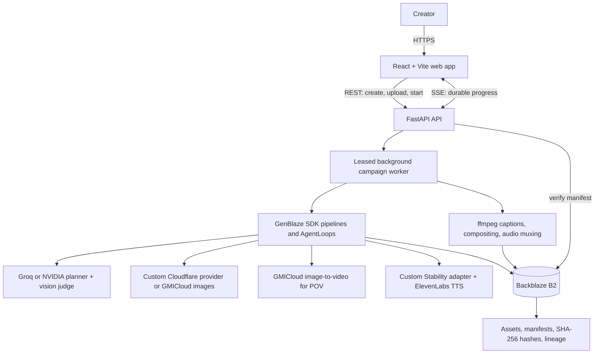
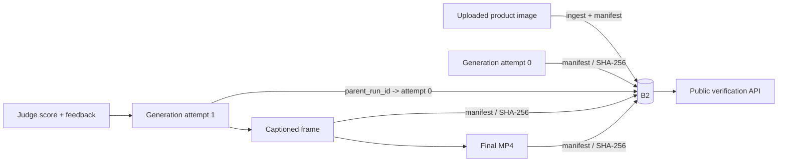

# ReelProof

### Generate a short-form video. Verify every frame behind it.

**ReelProof** is a GenBlaze SDK-powered, provenance-first AI studio for faceless short-form content. A creator enters a topic (and can upload a product image); ReelProof plans a story, generates vertical visuals through interchangeable providers, evaluates weak results, retries with targeted feedback, adds captions and music, and delivers a ready-to-post reel. Every input, intermediate, and final asset is durably stored in **Backblaze B2** with a GenBlaze provenance manifest and SHA-256 integrity record.

> Built for the **Backblaze B2 + Genblaze Generative AI Media Hackathon**.

| Submission link | URL                                                                              |
| --------------- | -------------------------------------------------------------------------------- |
| Live app        | **Add the deployed application URL before submitting to Devpost**                |
| Demo video      | **Add the ~3-minute demo video URL before submitting to Devpost**                |
| Source code     | [github.com/Abbas-Dev-786/ReelProof](https://github.com/Abbas-Dev-786/ReelProof) |

## Why ReelProof?

Short-form creators and small brands often juggle separate tools for ideation, image/video generation, captions, music, and editing. The result can be slow, inconsistent, and impossible to audit. They also need a way to demonstrate how AI media was made as disclosure expectations increase.

ReelProof turns this into one inspectable pipeline:

1. **Create** a vertical slideshow or POV montage from a topic and optional product images.
2. **Evaluate** every visual for hook strength, legibility, artifacts, and brand fit.
3. **Repair** weak visuals automatically with evaluator feedback, bounded retries, and provider fallbacks.
4. **Prove** the finished media with stored manifests, hashes, lineage, and a verification endpoint.

## What it does

- Plans a hook, 3-8 beats, captions, hashtags, and optional POV voiceover from a topic.
- Produces two 9:16 formats: a fast, captioned **slideshow** and an asynchronous **POV image-to-video montage**.
- Validates and ingests JPEG, PNG, and WebP product uploads before generation begins.
- Runs a bounded **generate -> judge -> refine -> regenerate** loop for each beat.
- Burns captions with ffmpeg instead of asking image models to render text, keeping copy crisp and legible.
- Generates optional background music and POV narration.
- Streams durable progress to the browser with SSE; reconnecting clients replay stored events.
- Delivers the final reel, individual assets, suggested social copy, and a verification-ready lineage trail.

## The self-healing media loop



The judge scores each result from `0.0` to `1.0` on **hook strength, text legibility, visual artifacts, and on-brand quality**. Results below the `0.70` threshold are regenerated with the judge's feedback. Genblaze `AgentLoop` limits the loop to two iterations, so quality improvement is visible without unbounded cost or latency. Every attempt is linked through `parent_run_id`, preserving the reject -> refine -> pass history.

## Architecture



### End-to-end asset lineage



## How this project uses Backblaze B2 and Genblaze

### Backblaze B2: the durable system of record

ReelProof uses B2 throughout the workflow, not merely as a final upload destination:

- Product uploads are ingested into B2 before they become generation inputs.
- Generated images, POV clips, music, voiceover, captioned frames, title cards, and final MP4s are persisted to B2.
- Every persisted run has a canonical Genblaze manifest with a SHA-256 hash and a B2-backed `manifest_uri`.
- The verify API fetches the stored manifest from B2 and validates its canonical hash and declared asset hashes.
- Durable URLs are stored in the database/manifests. For private buckets, the app returns temporary signed URLs only for browser playback and model/ffmpeg reads.
- Optional B2 Object Lock applies **GOVERNANCE** retention (365 days by default) to manifests. It must be enabled on the B2 bucket before use.
- Objects use Genblaze's hierarchical key strategy under the `reelproof` prefix.

### GenBlaze: the application runtime

GenBlaze is the workflow boundary between ReelProof and every generation vendor. The API and worker own campaign state; the SDK owns each media run, its provider execution, retry behavior, assets, and provenance record.

- `Pipeline` runs still-image, music, narration, ingest, and chained image-to-video steps with a consistent `Step`/`Asset` contract.
- `AgentLoop` builds a new image pipeline per beat attempt, sends its output to `VisionJudge`, and persists the reject -> refine -> pass sequence with `parent_run_id` lineage.
- `ObjectStorageSink` plus `S3StorageBackend.for_backblaze(...)` uploads assets and canonical manifests to B2 as part of a run, using the SDK's hierarchical key strategy.
- `external_inputs` supplies an uploaded, B2-backed product image to providers that accept image conditioning. For POV, the source image is persisted to B2 before the chained video provider is submitted.
- Provider-specific `RetryPolicy`, `fallback_models`, timeouts, and billed-video checkpoints make recovery an explicit part of the run instead of ad-hoc application retries.
- `Manifest.verify()` and `sink.read_manifest(..., verify=True)` power the verification endpoint; optional `ParquetSink` and LangSmith tracing add analytics and observability without becoming campaign dependencies.

The implementation lives primarily in `server/app/engine/`: `loop.py` wires the `AgentLoop`, `beat_render.py` builds the chained POV pipeline, `audio.py` creates audio pipelines, and `storage.py` creates the B2 sink.

## Provider implementations

ReelProof deliberately uses GenBlaze's provider interface instead of hiding vendor calls inside the worker. This keeps the provider/model, parameters, output assets, retry state, and hashes in the same manifest regardless of who generated the media.

### Project-owned GenBlaze extensions

| Extension | SDK surface | Why it exists | What it handles |
| --- | --- | --- | --- |
| [`CloudflareImageProvider`](server/app/engine/cloudflare_image.py) | `SyncProvider` | Cloudflare Workers AI is the default low-cost still-image path, but is not an off-the-shelf provider in this app. | Registers a GenBlaze image-model catalog; validates supported parameters; supports text-to-image and image-conditioned requests; converts chain input into base64; maps Cloudflare HTTP failures to typed `ProviderError`s; and normalizes raw-image or JSON/base64 responses into `Asset`s. |
| [`StabilityAudioProvider`](server/app/engine/stability_audio.py) | Subclass of `genblaze_stability_audio.StabilityAudioProvider` | Provides a narrow compatibility layer while retaining the upstream provider's generation and provenance behavior. | Sends Stable Audio's text-to-audio fields as required `multipart/form-data`, and fixes malformed Windows `file://` output URLs before later GenBlaze/B2 processing. |
| [`groq.chat`](server/app/engine/groq.py) | GenBlaze-compatible chat adapter | Groq is OpenAI-compatible, but the app needs explicit request budgets and observable physical attempts for planner and judge calls. | Normalizes GenBlaze chat messages and response formats, applies Groq strict-schema rules, maps errors to `ProviderErrorCode`, honors retry-after signals, and paces per-model token use. |

The first two are media providers used directly in `Pipeline.step(...)`. The Groq adapter is a companion integration for the planner and vision evaluator, which are deliberately outside a media pipeline but still return GenBlaze `ChatResponse` data and error semantics.

### Provider and model matrix

| Job | GenBlaze integration | Default model | Alternative / recovery path |
| --- | --- | --- | --- |
| Beat planning | Project Groq chat adapter | `openai/gpt-oss-20b` | `openai/gpt-oss-120b` on transient failure; NVIDIA NIM can be selected with `LLM_PROVIDER=nvidia`. |
| Visual quality judge | Project Groq chat adapter + GenBlaze `Evaluator` | `qwen/qwen3.6-27b` | NVIDIA NIM vision model when selected. The judge result drives `AgentLoop`. |
| Still / product imagery | Project `CloudflareImageProvider` | `@cf/bytedance/stable-diffusion-xl-lightning` | Set `IMAGE_PROVIDER=gmi` for GenBlaze GMICloud image models and their configured model fallbacks. |
| POV image-to-video | `genblaze-gmicloud` `GMICloudVideoProvider` | `pixverse-v5.6-i2v` | `seedance-1-0-pro-fast`, then `wan2.6-i2v`; submission IDs are checkpointed for resume. |
| Background music | Project `StabilityAudioProvider` | `stable-audio-2.5` | Optional per campaign; uses conservative SDK retry policy. |
| POV narration | `genblaze-elevenlabs` `ElevenLabsTTSProvider` | `eleven_v3` | Optional; enable with `VOICEOVER_ENABLED=true`. |
| Storage / manifests | `genblaze-s3` `S3StorageBackend` + `ObjectStorageSink` | Backblaze B2 | Private buckets use signed reads while durable manifest URLs remain stable. |
| Captions / assembly | Local ffmpeg after GenBlaze runs | — | Deterministic local rendering; resulting media is persisted and recorded in B2. |

### How provider selection works

`server/app/engine/images.py` is the still-image factory. Its `image_provider()` returns the custom Cloudflare provider by default or the stock GMICloud provider when `IMAGE_PROVIDER=gmi`; the rest of the pipeline is unchanged. That is the practical value of the GenBlaze abstraction: provider choice does not alter the beat loop, manifest format, storage path, or verification API.

For every media step, ReelProof passes the selected provider, model, modality, prompt, external inputs, fallback models, and a bounded retry policy to `Pipeline.step(...)`. The SDK records the resulting provider/model metadata alongside the output asset, and the sink persists the complete run to B2.

## Product workflow

| Stage    | Creator experience                                                     | What happens behind the scenes                                                                                  |
| -------- | ---------------------------------------------------------------------- | --------------------------------------------------------------------------------------------------------------- |
| Compose  | Enter a topic, choose slideshow or POV, optionally add a product image | A durable campaign job is created; uploads are validated, moderated, ingested, and recorded.                    |
| Plan     | See generation begin                                                   | A structured LLM plan creates the hook, visual concepts, captions, hashtags, and POV voiceover lines.           |
| Generate | Watch per-beat progress live                                           | Genblaze runs the selected media provider with retries/fallbacks and B2 persistence.                            |
| Evaluate | See judge status, score, and feedback                                  | A distinct vision model scores the visual. Failing beats are refined and regenerated.                           |
| Assemble | Receive an MP4 plus assets                                             | ffmpeg renders caption safe zones and combines frames/clips, music, and optional narration.                     |
| Verify   | Inspect manifest and lineage                                           | The API reloads the B2-backed manifest and returns verification, model/provider metadata, and parent run chain. |

## Quick start

### Prerequisites

- Python 3.11+
- Node.js 20+ and `pnpm`
- `ffmpeg` and `ffprobe` on your `PATH`
- A Backblaze B2 bucket and application key (S3-compatible API)
- API keys for Groq, Cloudflare Workers AI, Stability Audio, and selected optional providers

### 1. Configure and start the API

```powershell
cd server
Copy-Item .env.example .env
```

Edit `server/.env` with the required values:

```dotenv
# Planner and visual judge
GROQ_API_KEY=

# Default still-image provider
CLOUDFLARE_ACCOUNT_ID=
CLOUDFLARE_API_TOKEN=
# IMAGE_PROVIDER=cloudflare

# Alternative still-image provider (set IMAGE_PROVIDER=gmi)
# GMI_API_KEY=

# Optional LLM path (Groq is the default)
# LLM_PROVIDER=nvidia
# NVIDIA_API_KEY=

# Soundtrack
STABILITY_API_KEY=

# Backblaze B2
B2_KEY_ID=
B2_APP_KEY=
B2_BUCKET=reelproof-assets
B2_REGION=us-west-004

# Optional POV narration
# VOICEOVER_ENABLED=true
# ELEVENLABS_API_KEY=
```

The default configuration uses the project's `CloudflareImageProvider`. Set `IMAGE_PROVIDER=gmi` to switch the same GenBlaze image pipeline to `GMICloudImageProvider`; POV mode also requires `GMI_API_KEY` for its GMICloud video provider. Set `LLM_PROVIDER=nvidia` only when using the NVIDIA planner and vision-judge path; otherwise the project Groq adapter is used.

```powershell
python -m venv .venv
.\.venv\Scripts\Activate.ps1
python -m pip install --upgrade pip
python -m pip install -r requirements-dev.txt
python smoke_test.py
python -m uvicorn main:app --reload --port 8000
```

`smoke_test.py` validates configuration and required executables without paid model calls. `smoke_test.py --live` makes paid provider requests and should only be run against an approved test account and B2 bucket.

### 2. Configure and start the web app

In a second terminal:

```powershell
cd client
Copy-Item .env.example .env
pnpm install
pnpm dev
```

`client/.env` should contain:

```dotenv
VITE_API_URL=http://localhost:8000
```

Open the URL Vite prints (normally `http://localhost:5173`). The FastAPI default CORS configuration permits that local development origin.

### 3. Generate a campaign

1. Enter a topic, such as `A 5-step morning skincare ritual for busy travelers`.
2. Select **Slideshow** for the fastest end-to-end run, or **POV** for image-to-video.
3. Optionally upload product images before starting.
4. Watch planner, generation, judge, retry, assembly, B2 upload, and verification events.
5. Review/download the final MP4, individual media, suggested caption/hashtags, and provenance record.

## API surface

| Endpoint                          | Purpose                                                                      |
| --------------------------------- | ---------------------------------------------------------------------------- |
| `GET /health`                     | Health check used by the client header.                                      |
| `POST /campaigns`                 | Creates a pending or immediately started campaign.                           |
| `POST /campaigns/{job_id}/assets` | Validates and ingests a product image before campaign start.                 |
| `POST /campaigns/{job_id}/start`  | Claims and starts a pending campaign.                                        |
| `GET /campaigns/{job_id}/stream`  | SSE progress stream; stored events support `Last-Event-ID` reconnects.       |
| `GET /campaigns/{job_id}`         | Campaign result, output URLs, scores, social copy, and manifest information. |
| `GET /campaigns/{job_id}/package` | Full hand-off: output, uploaded assets, and provenance records.              |
| `GET /campaigns/{job_id}/lineage` | Campaign-wide provenance/lineage records.                                    |
| `GET /verify/{run_id}`            | Re-reads the B2-backed manifest and returns verification plus lineage.       |

## Reliability, safety, and production path

- **Reliable jobs:** campaign workers have renewable database leases. Expired jobs are requeued at server startup, while POV provider requests are checkpointed for resume.
- **Bounded expense:** image, audio, video, and LLM calls have explicit timeout/retry caps. Agent loops have a maximum iteration count and report Genblaze cost data.
- **Provider resilience:** planner, image, and video model fallbacks are configured where supported.
- **Safe media handling:** uploads receive size, pixel, MIME, and image-validity checks; pipelines apply a baseline moderation hook to prompts and output assets.
- **Private B2 support:** stable B2 URLs remain in manifests; only short-lived presigned GET URLs are exposed to browsers or passed to tools requiring a readable input.
- **Observability:** optional LangSmith tracing captures campaign roots, model calls, retries, latency, and media activity. It is fail-open, so unavailable tracing never fails a campaign.
- **Scale path:** SQLite and in-process worker threads are intentionally MVP-simple. A multi-host deployment should use a shared production database and managed job queue before increasing concurrency.

## Verification model

```text
Asset bytes --SHA-256--> Genblaze manifest --canonical hash--> Backblaze B2
     |                                                       |
     +-- provider / model / prompt / parameters / time -----+
                                                             |
                             GET /verify/{run_id} <----------+
                                     |
                                     v
                  manifest + asset-hash integrity result
                  provider/model metadata + parent lineage
```

Hash verification shows that the manifest and its declared assets remain internally consistent; optional B2 Object Lock adds retention-based protection against modification. Together they give creators an auditable record of how each final asset was produced.

## Repository layout

```text
client/                     React 19 + Vite creator workspace
  src/features/campaign/    Composer, progress UI, preview, deliverables, lineage
server/                     FastAPI application and media worker
  app/api/                  REST, SSE, upload, package, lineage, verify routes
  app/engine/               Planning, generation, judging, captions, audio, assembly
  app/jobs/                 SQLite-backed durable jobs, events, leases, checkpoints
  app/storage.py            B2 backend, Object Lock, signed URL, manifest verification
  tests/                    Unit and workflow tests
genblaze/                   Local Genblaze SDK source/docs used during development
docs/                       PRD, architecture, and build plan
```
